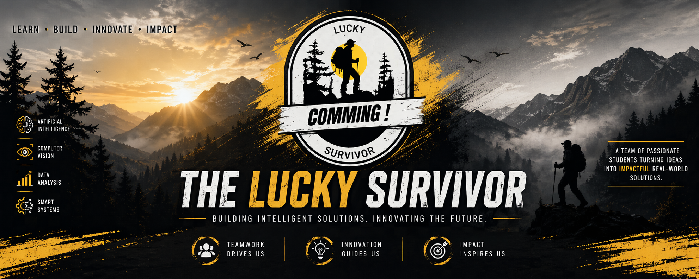

  

<h1 align="center">The Lucky Survivor</h1>

  
  

<h3 align="center">Artificial Intelligence • Computer Vision • Data Analysis • Smart Engineering Solutions</h3>

  A student-driven organization focused on building practical, intelligent, and impactful AI projects.

---

## ✨ About Us

**The Lucky Survivor** is a student technology organization dedicated to creating real-world projects in **Artificial Intelligence**, **Computer Vision**, **Data Analysis**, and **Smart Engineering Systems**.

Our work reflects the spirit of learning by building — transforming academic knowledge into practical solutions that solve meaningful problems and showcase innovation, teamwork, and technical growth.

We are especially passionate about AI-driven applications, intelligent automation, and projects that connect theory with real implementation.

---

## 🧠 Our Team

  <a href="https://eg.linkedin.com/in/seif-el-dein-ayman-9942702b9?utm_source=share&utm_medium=member_mweb&utm_campaign=share_via&utm_content=profile"><b>Seif El-Dein</b></a> •
  <a href="https://eg.linkedin.com/in/ibrahem-elashry-aa6032307?utm_source=share&utm_medium=member_mweb&utm_campaign=share_via&utm_content=profile"><b>Ibrahem Elashry</b></a> •
  <a href="https://eg.linkedin.com/in/abdallah-el-mallah?utm_source=share&utm_medium=member_mweb&utm_campaign=share_via&utm_content=profile"><b>Abdallah El-Mallah</b></a> •
  <a href="https://eg.linkedin.com/in/ahmed-ashraf-fawzy-fouad-ibrahim-issa-alhaitawi"><b>Ahmed Ashraf</b></a>

  A collaborative student team passionate about AI, engineering, and building impactful graduation projects.

---

## 🚀 Featured Repositories

### 1) [Car-Sales-Analysis](https://github.com/The-lucky-Survivor/Car-Sales-Analysis)
**Data-Driven Insights for Automotive Sales Intelligence**  
A data analysis project focused on extracting useful insights from car sales data using analytical and visualization techniques.

### 2) [weapon-detection-yolov11n](https://github.com/The-lucky-Survivor/weapon-detection-yolov11n)
**Real-time weapon detection using YOLOv11n**  
A computer vision project that applies deep learning for real-time weapon detection scenarios.

### 3) [Wireless-CNC-Plotter](https://github.com/The-lucky-Survivor/Wireless-CNC-Plotter)
**Smart engineering and automation project**  
A hardware-oriented implementation combining control, automation, and CNC plotting concepts.

---

## ⚙️ Core Technologies Across Our Projects

  
  
  
  

  
  
  
  

  
  
  
  

  <b>Python • Data Analysis • Machine Learning • Deep Learning • Computer Vision • Embedded Systems • Automation</b>

---

## 💡 What We Focus On

- Artificial Intelligence  
- Machine Learning  
- Deep Learning  
- Computer Vision  
- Data Analysis  
- Intelligent Automation  
- Embedded & Smart Systems  

---

## 🌍 Our Vision

We aim to build projects that go beyond academic requirements and become strong examples of practical innovation, technical depth, and real-world impact.

Our vision is to create intelligent systems that reflect creativity, problem-solving, and the future of AI-driven technology.

---

## 🌐 Connect With Us

  <a href="https://github.com/The-lucky-Survivor">GitHub Organization</a> •
  <a href="https://eg.linkedin.com/in/abdallah-el-mallah?utm_source=share&utm_medium=member_mweb&utm_campaign=share_via&utm_content=profile">LinkedIn</a>

---

  <b>Building meaningful AI projects with purpose, teamwork, and innovation.</b>

